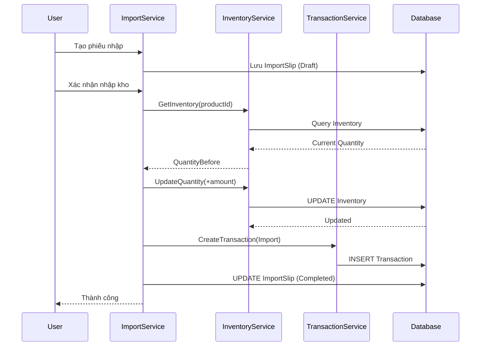
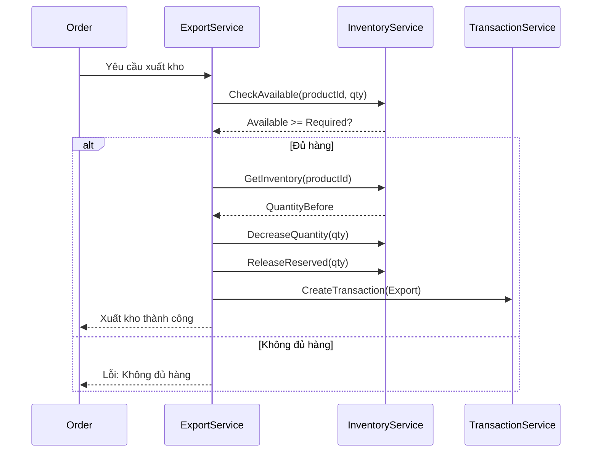
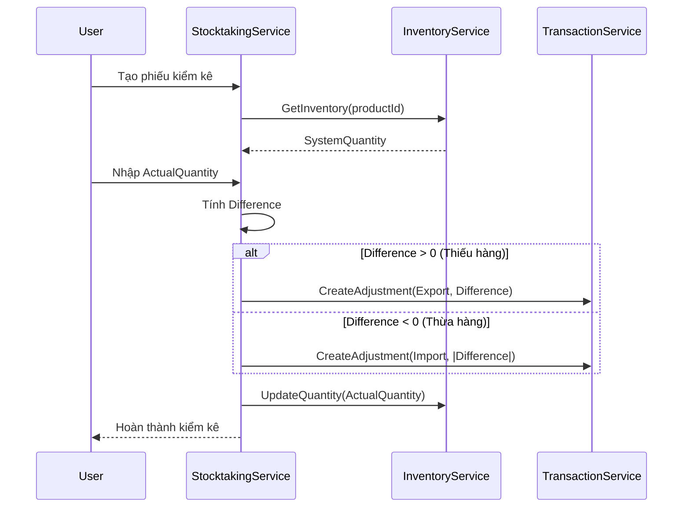

# Giải Pháp Quản Lý Kho Cho Website Bán Điện Thoại

## 📋 Mục Lục
1. [Tổng Quan Hệ Thống](#tổng-quan-hệ-thống)
2. [Kiến Trúc Hệ Thống](#kiến-trúc-hệ-thống)
3. [Các Module Chính](#các-module-chính)
4. [Luồng Xử Lý](#luồng-xử-lý)
5. [Tính Năng Chi Tiết](#tính-năng-chi-tiết)
6. [Database Schema](#database-schema)
7. [API & Services](#api--services)
8. [Giao Diện Người Dùng](#giao-diện-người-dùng)
9. [Báo Cáo & Thống Kê](#báo-cáo--thống-kê)
10. [Best Practices](#best-practices)

---

## 1. Tổng Quan Hệ Thống

### 1.1. Mục Tiêu
- Quản lý nhập kho (Import) từ nhà cung cấp
- Quản lý xuất kho (Export) cho đơn hàng, trả hàng, hỏng hóc
- Theo dõi hàng tồn kho (Stock) real-time
- Thực hiện kiểm kê kho (Stocktaking) định kỳ
- Cảnh báo hàng sắp hết, cần nhập thêm
- Báo cáo tồn kho, nhập xuất theo thời gian

### 1.2. Đối Tượng Sử Dụng
- **Quản lý kho**: Nhập/xuất hàng, kiểm kê
- **Nhân viên bán hàng**: Xem tồn kho, đặt hàng
- **Kế toán**: Báo cáo, thống kê
- **Admin**: Quản lý toàn bộ hệ thống

---

## 2. Kiến Trúc Hệ Thống

```
┌─────────────────────────────────────────────────────────────┐
│                    PRESENTATION LAYER                       │
│  ┌──────────────┐  ┌──────────────┐  ┌──────────────┐    │
│  │  Admin UI    │  │  Staff UI    │  │  Mobile App  │    │
│  └──────┬───────┘  └──────┬───────┘  └──────┬───────┘    │
└─────────┼─────────────────┼─────────────────┼────────────┘
          │                 │                 │
┌─────────▼─────────────────▼─────────────────▼────────────┐
│                  APPLICATION LAYER                        │
│  ┌────────────────────────────────────────────────────┐   │
│  │     InventoryTransactionAppService                 │   │
│  │  - ImportInventory()                              │   │
│  │  - ExportInventory()                              │   │
│  │  - AdjustInventory()                              │   │
│  └────────────────────────────────────────────────────┘   │
│  ┌────────────────────────────────────────────────────┐   │
│  │     InventoryAppService                            │   │
│  │  - GetCurrentStock()                               │   │
│  │  - ReserveInventory()                              │   │
│  │  - ReleaseReservedInventory()                      │   │
│  └────────────────────────────────────────────────────┘   │
│  ┌────────────────────────────────────────────────────┐   │
│  │     StocktakingAppService                          │   │
│  │  - CreateStocktaking()                             │   │
│  │  - CompleteStocktaking()                           │   │
│  └────────────────────────────────────────────────────┘   │
└─────────┬───────────────────────────────────────────────┘
          │
┌─────────▼───────────────────────────────────────────────┐
│                    DOMAIN LAYER                          │
│  ┌──────────────┐  ┌──────────────┐  ┌──────────────┐  │
│  │  Inventory   │  │  Transaction │  │ Stocktaking  │  │
│  │  (Tồn kho)   │  │  (Lịch sử)   │  │  (Kiểm kê)   │  │
│  └──────────────┘  └──────────────┘  └──────────────┘  │
└─────────┬───────────────────────────────────────────────┘
          │
┌─────────▼───────────────────────────────────────────────┐
│                  DATA ACCESS LAYER                       │
│              Entity Framework Core                        │
└──────────────────────────────────────────────────────────┘
```

---

## 3. Các Module Chính

### 3.1. Module Nhập Kho (Import Module)

#### Chức năng:
- ✅ Nhập hàng từ nhà cung cấp
- ✅ Nhập hàng trả lại từ khách hàng
- ✅ Nhập hàng điều chỉnh (sau kiểm kê)
- ✅ Nhập hàng chuyển kho từ kho khác

#### Luồng xử lý:
```
1. Tạo phiếu nhập kho (Import Slip)
   ├─ Chọn nhà cung cấp
   ├─ Chọn sản phẩm và số lượng
   ├─ Nhập giá nhập, ngày nhập
   └─ Ghi chú (nếu có)

2. Xác nhận nhập kho
   ├─ Kiểm tra dữ liệu hợp lệ
   ├─ Cập nhật Inventory.Quantity += số lượng
   ├─ Tạo InventoryTransaction (Type = Import)
   ├─ Cập nhật giá nhập trung bình (nếu cần)
   └─ Gửi thông báo

3. In phiếu nhập kho
```

### 3.2. Module Xuất Kho (Export Module)

#### Chức năng:
- ✅ Xuất hàng cho đơn hàng (Order Fulfillment)
- ✅ Xuất hàng trả nhà cung cấp
- ✅ Xuất hàng hỏng hóc, mất mát
- ✅ Xuất hàng điều chỉnh (sau kiểm kê)
- ✅ Xuất hàng chuyển kho

#### Luồng xử lý:
```
1. Tạo phiếu xuất kho (Export Slip)
   ├─ Chọn lý do xuất (Order, Return, Damage, etc.)
   ├─ Chọn sản phẩm và số lượng
   ├─ Kiểm tra tồn kho đủ không
   └─ Ghi chú

2. Xác nhận xuất kho
   ├─ Kiểm tra AvailableQuantity >= số lượng
   ├─ Cập nhật Inventory.Quantity -= số lượng
   ├─ Giảm ReservedQuantity (nếu xuất cho đơn hàng)
   ├─ Tạo InventoryTransaction (Type = Export)
   └─ Cập nhật trạng thái đơn hàng (nếu có)

3. In phiếu xuất kho
```

### 3.3. Module Quản Lý Tồn Kho (Stock Management)

#### Chức năng:
- ✅ Xem tồn kho hiện tại theo sản phẩm
- ✅ Xem tồn kho theo kho/vị trí (nếu có nhiều kho)
- ✅ Cảnh báo hàng sắp hết (Low Stock Alert)
- ✅ Cảnh báo cần đặt hàng (Reorder Alert)
- ✅ Lịch sử biến động tồn kho
- ✅ Dự báo tồn kho (Forecasting)

#### Các trạng thái tồn kho:
- **Available**: Số lượng có thể bán = Quantity - ReservedQuantity
- **Reserved**: Số lượng đã giữ cho đơn hàng
- **Low Stock**: Quantity <= MinQuantity
- **Out of Stock**: Quantity = 0
- **Need Reorder**: Quantity <= ReorderLevel

### 3.4. Module Kiểm Kê Kho (Stocktaking Module)

#### Chức năng:
- ✅ Tạo phiếu kiểm kê định kỳ
- ✅ Kiểm kê theo sản phẩm hoặc toàn bộ kho
- ✅ So sánh tồn kho thực tế vs hệ thống
- ✅ Điều chỉnh chênh lệch tự động
- ✅ Báo cáo kết quả kiểm kê

#### Luồng xử lý:
```
1. Tạo phiếu kiểm kê
   ├─ Chọn kho/vị trí
   ├─ Chọn sản phẩm cần kiểm kê
   ├─ Gán nhân viên thực hiện
   └─ Ngày dự kiến hoàn thành

2. Thực hiện kiểm kê
   ├─ Nhập số lượng thực tế (Actual Quantity)
   ├─ Hệ thống tự tính chênh lệch:
   │   Difference = Actual - System
   └─ Ghi chú lý do chênh lệch (nếu có)

3. Xác nhận và điều chỉnh
   ├─ Phê duyệt kết quả kiểm kê
   ├─ Tự động tạo Transaction điều chỉnh:
   │   - Nếu Actual > System → Import (Difference)
   │   - Nếu Actual < System → Export (Difference)
   ├─ Cập nhật Inventory.Quantity = Actual
   └─ Tạo báo cáo kiểm kê
```

---

## 4. Luồng Xử Lý

### 4.1. Luồng Nhập Kho



### 4.2. Luồng Xuất Kho



### 4.3. Luồng Kiểm Kê Kho



---

## 5. Tính Năng Chi Tiết

### 5.1. Nhập Kho

#### 5.1.1. Các loại nhập kho:
1. **Nhập từ nhà cung cấp** (Supplier Import)
   - Liên kết với Purchase Order
   - Cập nhật giá nhập trung bình
   - Tạo công nợ nhà cung cấp

2. **Nhập hàng trả lại** (Return Import)
   - Liên kết với Order Return
   - Kiểm tra chất lượng hàng trả

3. **Nhập điều chỉnh** (Adjustment Import)
   - Sau kiểm kê phát hiện thiếu
   - Điều chỉnh lỗi hệ thống

4. **Nhập chuyển kho** (Transfer Import)
   - Từ kho khác chuyển đến
   - Đồng bộ với Export của kho nguồn

#### 5.1.2. Thông tin phiếu nhập:
```csharp
public class ImportSlip
{
    public int Id { get; set; }
    public string ImportCode { get; set; } // Mã phiếu nhập
    public DateTime ImportDate { get; set; }
    public int? SupplierId { get; set; } // Nhà cung cấp
    public ImportType Type { get; set; } // Loại nhập
    public ImportStatus Status { get; set; } // Draft, Completed, Cancelled
    public string Notes { get; set; }
    public List<ImportDetail> Details { get; set; }
    public long CreatedBy { get; set; }
}

public class ImportDetail
{
    public int ProductId { get; set; }
    public int Quantity { get; set; }
    public decimal UnitPrice { get; set; } // Giá nhập
    public decimal TotalAmount { get; set; }
}
```

### 5.2. Xuất Kho

#### 5.2.1. Các loại xuất kho:
1. **Xuất cho đơn hàng** (Order Export)
   - Tự động khi đơn hàng được xác nhận
   - Giảm ReservedQuantity
   - Liên kết với OrderId

2. **Xuất trả nhà cung cấp** (Supplier Return)
   - Hàng lỗi, không đạt chất lượng
   - Liên kết với SupplierId

3. **Xuất hỏng hóc** (Damage Export)
   - Hàng bị hỏng trong kho
   - Cần ghi chú lý do

4. **Xuất điều chỉnh** (Adjustment Export)
   - Sau kiểm kê phát hiện thừa
   - Điều chỉnh lỗi hệ thống

5. **Xuất chuyển kho** (Transfer Export)
   - Chuyển sang kho khác
   - Đồng bộ với Import của kho đích

#### 5.2.2. Thông tin phiếu xuất:
```csharp
public class ExportSlip
{
    public int Id { get; set; }
    public string ExportCode { get; set; }
    public DateTime ExportDate { get; set; }
    public ExportType Type { get; set; }
    public int? OrderId { get; set; } // Nếu xuất cho đơn hàng
    public int? SupplierId { get; set; } // Nếu trả nhà cung cấp
    public ExportStatus Status { get; set; }
    public string Reason { get; set; } // Lý do xuất
    public List<ExportDetail> Details { get; set; }
    public long CreatedBy { get; set; }
}
```

### 5.3. Kiểm Kê Kho

#### 5.3.1. Quy trình kiểm kê:
1. **Lập kế hoạch kiểm kê**
   - Chọn kho/vị trí
   - Chọn sản phẩm cần kiểm kê
   - Phân công nhân viên
   - Lịch thực hiện

2. **Thực hiện kiểm kê**
   - Đếm số lượng thực tế
   - Nhập vào hệ thống
   - Chụp ảnh (nếu cần)
   - Ghi chú

3. **Xử lý chênh lệch**
   - Tự động tính chênh lệch
   - Phân tích nguyên nhân
   - Phê duyệt điều chỉnh
   - Tạo Transaction điều chỉnh

#### 5.3.2. Thông tin phiếu kiểm kê:
```csharp
public class Stocktaking
{
    public int Id { get; set; }
    public string StocktakingCode { get; set; }
    public DateTime PlannedDate { get; set; }
    public DateTime? CompletedDate { get; set; }
    public StocktakingStatus Status { get; set; } // Planned, InProgress, Completed, Cancelled
    public int? WarehouseId { get; set; } // Nếu có nhiều kho
    public List<StocktakingDetail> Details { get; set; }
    public long AssignedTo { get; set; } // Người thực hiện
    public string Notes { get; set; }
}

public class StocktakingDetail
{
    public int ProductId { get; set; }
    public int SystemQuantity { get; set; } // Từ Inventory
    public int ActualQuantity { get; set; } // Đếm thực tế
    public int Difference { get; set; } // Actual - System
    public string Reason { get; set; } // Lý do chênh lệch
    public bool IsAdjusted { get; set; } // Đã điều chỉnh chưa
}
```

---

## 6. Database Schema

### 6.1. Bảng hiện có (Đã có sẵn)

#### Inventory (Tồn kho)
```sql
CREATE TABLE AppInventories (
    Id INT PRIMARY KEY,
    ProductId INT NOT NULL,
    Quantity INT NOT NULL DEFAULT 0,
    ReservedQuantity INT NOT NULL DEFAULT 0,
    ReorderLevel INT DEFAULT 0,
    MinQuantity INT DEFAULT 0,
    Unit NVARCHAR(50),
    Status TINYINT,
    LastUpdated DATETIME,
    Notes NVARCHAR(500),
    -- Audit fields
    CreationTime DATETIME,
    CreatorUserId BIGINT,
    LastModificationTime DATETIME,
    LastModifierUserId BIGINT
);
```

#### InventoryTransaction (Lịch sử giao dịch)
```sql
CREATE TABLE AppInventoryTransactions (
    Id INT PRIMARY KEY,
    ProductId INT NOT NULL,
    Type TINYINT NOT NULL, -- 1=Import, 2=Export, 3=Adjustment
    Quantity INT NOT NULL,
    QuantityBefore INT NOT NULL,
    QuantityAfter INT NOT NULL,
    Reason NVARCHAR(500),
    ReferenceId INT, -- ID của ImportSlip/ExportSlip/Stocktaking
    ReferenceType NVARCHAR(50), -- 'ImportSlip', 'ExportSlip', 'Stocktaking'
    TransactionDate DATETIME NOT NULL,
    Notes NVARCHAR(1000),
    -- Audit fields
    CreationTime DATETIME,
    CreatorUserId BIGINT
);
```

### 6.2. Bảng cần bổ sung

#### ImportSlip (Phiếu nhập kho)
```sql
CREATE TABLE AppImportSlips (
    Id INT PRIMARY KEY IDENTITY,
    ImportCode NVARCHAR(50) UNIQUE NOT NULL, -- Mã phiếu nhập
    ImportDate DATETIME NOT NULL,
    SupplierId INT NULL, -- FK to Suppliers
    Type TINYINT NOT NULL, -- 1=Supplier, 2=Return, 3=Adjustment, 4=Transfer
    Status TINYINT NOT NULL DEFAULT 0, -- 0=Draft, 1=Completed, 2=Cancelled
    TotalAmount DECIMAL(18,2) DEFAULT 0,
    Notes NVARCHAR(1000),
    -- Audit fields
    CreationTime DATETIME,
    CreatorUserId BIGINT,
    LastModificationTime DATETIME,
    LastModifierUserId BIGINT
);
```

#### ImportDetail (Chi tiết phiếu nhập)
```sql
CREATE TABLE AppImportDetails (
    Id INT PRIMARY KEY IDENTITY,
    ImportSlipId INT NOT NULL, -- FK to ImportSlip
    ProductId INT NOT NULL,
    Quantity INT NOT NULL,
    UnitPrice DECIMAL(18,2) NOT NULL,
    TotalAmount DECIMAL(18,2) NOT NULL,
    Notes NVARCHAR(500)
);
```

#### ExportSlip (Phiếu xuất kho)
```sql
CREATE TABLE AppExportSlips (
    Id INT PRIMARY KEY IDENTITY,
    ExportCode NVARCHAR(50) UNIQUE NOT NULL,
    ExportDate DATETIME NOT NULL,
    Type TINYINT NOT NULL, -- 1=Order, 2=SupplierReturn, 3=Damage, 4=Adjustment, 5=Transfer
    OrderId INT NULL, -- FK to Orders (nếu xuất cho đơn hàng)
    SupplierId INT NULL, -- FK to Suppliers (nếu trả nhà cung cấp)
    Status TINYINT NOT NULL DEFAULT 0, -- 0=Draft, 1=Completed, 2=Cancelled
    Reason NVARCHAR(500),
    Notes NVARCHAR(1000),
    -- Audit fields
    CreationTime DATETIME,
    CreatorUserId BIGINT,
    LastModificationTime DATETIME,
    LastModifierUserId BIGINT
);
```

#### ExportDetail (Chi tiết phiếu xuất)
```sql
CREATE TABLE AppExportDetails (
    Id INT PRIMARY KEY IDENTITY,
    ExportSlipId INT NOT NULL, -- FK to ExportSlip
    ProductId INT NOT NULL,
    Quantity INT NOT NULL,
    Notes NVARCHAR(500)
);
```

#### Stocktaking (Phiếu kiểm kê)
```sql
CREATE TABLE AppStocktakings (
    Id INT PRIMARY KEY IDENTITY,
    StocktakingCode NVARCHAR(50) UNIQUE NOT NULL,
    PlannedDate DATETIME NOT NULL,
    CompletedDate DATETIME NULL,
    Status TINYINT NOT NULL DEFAULT 0, -- 0=Planned, 1=InProgress, 2=Completed, 3=Cancelled
    WarehouseId INT NULL, -- Nếu có nhiều kho
    AssignedTo BIGINT NULL, -- UserId người thực hiện
    Notes NVARCHAR(1000),
    -- Audit fields
    CreationTime DATETIME,
    CreatorUserId BIGINT,
    LastModificationTime DATETIME,
    LastModifierUserId BIGINT
);
```

#### StocktakingDetail (Chi tiết kiểm kê)
```sql
CREATE TABLE AppStocktakingDetails (
    Id INT PRIMARY KEY IDENTITY,
    StocktakingId INT NOT NULL, -- FK to Stocktaking
    ProductId INT NOT NULL,
    SystemQuantity INT NOT NULL, -- Từ Inventory
    ActualQuantity INT NOT NULL, -- Đếm thực tế
    Difference INT NOT NULL, -- Actual - System
    Reason NVARCHAR(500), -- Lý do chênh lệch
    IsAdjusted BIT DEFAULT 0, -- Đã điều chỉnh chưa
    AdjustedDate DATETIME NULL
);
```

---

## 7. API & Services

### 7.1. ImportInventoryAppService

```csharp
public interface IImportInventoryAppService : IApplicationService
{
    // Tạo phiếu nhập
    Task<ImportSlipDto> CreateImportSlip(CreateImportSlipDto input);
    
    // Xác nhận nhập kho
    Task CompleteImportSlip(int importSlipId);
    
    // Hủy phiếu nhập
    Task CancelImportSlip(int importSlipId);
    
    // Lấy danh sách phiếu nhập
    Task<PagedResultDto<ImportSlipDto>> GetAllImportSlips(GetAllImportSlipsInput input);
    
    // Lấy chi tiết phiếu nhập
    Task<ImportSlipDetailDto> GetImportSlipById(int id);
}
```

### 7.2. ExportInventoryAppService

```csharp
public interface IExportInventoryAppService : IApplicationService
{
    // Tạo phiếu xuất
    Task<ExportSlipDto> CreateExportSlip(CreateExportSlipDto input);
    
    // Xác nhận xuất kho
    Task CompleteExportSlip(int exportSlipId);
    
    // Hủy phiếu xuất
    Task CancelExportSlip(int exportSlipId);
    
    // Xuất kho cho đơn hàng (tự động)
    Task AutoExportForOrder(int orderId);
    
    // Lấy danh sách phiếu xuất
    Task<PagedResultDto<ExportSlipDto>> GetAllExportSlips(GetAllExportSlipsInput input);
}
```

### 7.3. StocktakingAppService

```csharp
public interface IStocktakingAppService : IApplicationService
{
    // Tạo phiếu kiểm kê
    Task<StocktakingDto> CreateStocktaking(CreateStocktakingDto input);
    
    // Cập nhật số lượng thực tế
    Task UpdateActualQuantity(int stocktakingId, int productId, int actualQuantity);
    
    // Hoàn thành kiểm kê và điều chỉnh
    Task CompleteStocktaking(int stocktakingId);
    
    // Lấy danh sách phiếu kiểm kê
    Task<PagedResultDto<StocktakingDto>> GetAllStocktakings(GetAllStocktakingsInput input);
    
    // Lấy chi tiết phiếu kiểm kê
    Task<StocktakingDetailDto> GetStocktakingById(int id);
}
```

### 7.4. Cải tiến InventoryAppService

```csharp
// Thêm các method mới
public interface IInventoryAppService : IApplicationService
{
    // Xem tồn kho hiện tại
    Task<InventoryStockDto> GetCurrentStock(int productId);
    Task<List<InventoryStockDto>> GetCurrentStockByProducts(List<int> productIds);
    
    // Cảnh báo hàng sắp hết
    Task<List<LowStockAlertDto>> GetLowStockAlerts();
    Task<List<ReorderAlertDto>> GetReorderAlerts();
    
    // Lịch sử biến động
    Task<PagedResultDto<StockHistoryDto>> GetStockHistory(int productId, DateTime? fromDate, DateTime? toDate);
    
    // Báo cáo tồn kho
    Task<StockReportDto> GetStockReport(StockReportInput input);
}
```

---

## 8. Giao Diện Người Dùng

### 8.1. Trang Quản Lý Nhập Kho

#### Danh sách phiếu nhập:
- Bảng danh sách với filter: Mã phiếu, Nhà cung cấp, Ngày, Trạng thái
- Nút "Tạo phiếu nhập mới"
- Xem chi tiết, In phiếu, Hủy phiếu

#### Form tạo/sửa phiếu nhập:
- Thông tin chung: Mã phiếu, Ngày nhập, Nhà cung cấp, Loại nhập
- Chi tiết sản phẩm: Bảng thêm sản phẩm, Số lượng, Giá nhập, Thành tiền
- Tổng tiền tự động tính
- Nút "Lưu nháp", "Xác nhận nhập kho"

### 8.2. Trang Quản Lý Xuất Kho

#### Danh sách phiếu xuất:
- Tương tự phiếu nhập
- Filter thêm: Loại xuất, Đơn hàng

#### Form tạo/sửa phiếu xuất:
- Thông tin chung: Mã phiếu, Ngày xuất, Lý do xuất, Đơn hàng (nếu có)
- Chi tiết sản phẩm: Chọn sản phẩm, Kiểm tra tồn kho, Số lượng
- Cảnh báo nếu không đủ hàng
- Nút "Lưu nháp", "Xác nhận xuất kho"

### 8.3. Trang Quản Lý Tồn Kho

#### Dashboard tồn kho:
- Tổng số sản phẩm
- Tổng giá trị tồn kho
- Số sản phẩm sắp hết
- Số sản phẩm cần đặt hàng
- Biểu đồ tồn kho theo thời gian

#### Danh sách tồn kho:
- Bảng: Sản phẩm, Tồn kho, Đã giữ, Có thể bán, Trạng thái
- Filter: Sản phẩm, Trạng thái (Còn hàng/Sắp hết/Hết hàng)
- Sort: Theo số lượng, Giá trị
- Xem lịch sử biến động

### 8.4. Trang Kiểm Kê Kho

#### Danh sách phiếu kiểm kê:
- Bảng: Mã phiếu, Ngày dự kiến, Ngày hoàn thành, Trạng thái, Người thực hiện
- Filter: Trạng thái, Kho, Ngày
- Nút "Tạo phiếu kiểm kê mới"

#### Form kiểm kê:
- Chọn sản phẩm cần kiểm kê
- Bảng: Sản phẩm, Tồn kho hệ thống, Số lượng thực tế, Chênh lệch
- Tự động tính chênh lệch
- Nhập lý do chênh lệch
- Nút "Hoàn thành kiểm kê" → Tự động điều chỉnh

---

## 9. Báo Cáo & Thống Kê

### 9.1. Báo Cáo Tồn Kho

1. **Báo cáo tồn kho hiện tại**
   - Theo sản phẩm
   - Theo danh mục
   - Theo kho (nếu có nhiều kho)
   - Export Excel

2. **Báo cáo giá trị tồn kho**
   - Tổng giá trị tồn kho
   - Giá trị theo danh mục
   - Biểu đồ phân bổ

### 9.2. Báo Cáo Nhập Xuất

1. **Báo cáo nhập kho**
   - Theo thời gian (ngày/tuần/tháng)
   - Theo nhà cung cấp
   - Theo sản phẩm
   - Tổng số lượng, Tổng giá trị

2. **Báo cáo xuất kho**
   - Theo thời gian
   - Theo lý do xuất
   - Theo sản phẩm
   - Tổng số lượng, Tổng giá trị

3. **Báo cáo tổng hợp nhập xuất**
   - So sánh nhập vs xuất
   - Tỷ lệ xuất/nhập
   - Xu hướng biến động

### 9.3. Báo Cáo Kiểm Kê

1. **Báo cáo kết quả kiểm kê**
   - Số sản phẩm kiểm kê
   - Số sản phẩm chênh lệch
   - Tỷ lệ chính xác
   - Giá trị chênh lệch

2. **Phân tích nguyên nhân chênh lệch**
   - Thống kê theo lý do
   - Sản phẩm thường xuyên chênh lệch
   - Đề xuất cải thiện

### 9.4. Cảnh Báo Tự Động

1. **Cảnh báo hàng sắp hết**
   - Email/SMS khi Quantity <= MinQuantity
   - Dashboard hiển thị danh sách

2. **Cảnh báo cần đặt hàng**
   - Khi Quantity <= ReorderLevel
   - Gợi ý số lượng đặt hàng

3. **Cảnh báo tồn kho bất thường**
   - Tồn kho quá cao (có thể ứ đọng)
   - Không có biến động trong thời gian dài

---

## 10. Best Practices

### 10.1. Nguyên Tắc Xử Lý

1. **Luôn tạo Transaction khi thay đổi Inventory**
   - Mọi thay đổi Quantity phải có Transaction tương ứng
   - Transaction không được sửa/xóa (Audit Trail)

2. **Kiểm tra tồn kho trước khi xuất**
   - Luôn check AvailableQuantity >= RequiredQuantity
   - Không cho phép xuất quá số lượng có

3. **Reserve/Release khi đặt hàng**
   - Reserve khi đơn hàng được tạo
   - Release khi đơn hàng bị hủy
   - Commit khi đơn hàng được xác nhận

4. **Xử lý giao dịch (Transaction)**
   - Sử dụng UnitOfWork để đảm bảo tính nhất quán
   - Rollback nếu có lỗi

### 10.2. Performance Optimization

1. **Index Database**
   ```sql
   CREATE INDEX IX_Inventory_ProductId ON AppInventories(ProductId);
   CREATE INDEX IX_Transaction_ProductId_Date ON AppInventoryTransactions(ProductId, TransactionDate);
   CREATE INDEX IX_Transaction_Type ON AppInventoryTransactions(Type);
   ```

2. **Cache tồn kho**
   - Cache Inventory cho các sản phẩm hot
   - Invalidate cache khi có thay đổi

3. **Batch Processing**
   - Xử lý nhiều sản phẩm cùng lúc
   - Giảm số lần query database

### 10.3. Security & Permissions

1. **Phân quyền**
   - Quản lý kho: Full access
   - Nhân viên: Chỉ xem, không sửa
   - Kế toán: Xem báo cáo

2. **Audit Log**
   - Ghi lại mọi thay đổi
   - Lưu thông tin người thực hiện
   - Không cho phép xóa log

### 10.4. Validation Rules

1. **Validation nhập kho**
   - Số lượng > 0
   - Giá nhập > 0
   - Ngày nhập không quá tương lai

2. **Validation xuất kho**
   - Số lượng > 0
   - AvailableQuantity >= RequiredQuantity
   - Có lý do xuất (nếu không phải đơn hàng)

3. **Validation kiểm kê**
   - ActualQuantity >= 0
   - Có lý do nếu chênh lệch lớn

---

## 11. Implementation Roadmap

### Phase 1: Core Features (2-3 tuần)
- ✅ Module nhập kho cơ bản
- ✅ Module xuất kho cơ bản
- ✅ Cải thiện InventoryAppService
- ✅ UI danh sách tồn kho

### Phase 2: Advanced Features (2-3 tuần)
- ✅ Module kiểm kê kho
- ✅ Cảnh báo tự động
- ✅ Báo cáo cơ bản

### Phase 3: Enhancement (1-2 tuần)
- ✅ Báo cáo nâng cao
- ✅ Export Excel
- ✅ Dashboard tồn kho
- ✅ Mobile responsive

### Phase 4: Optimization (1 tuần)
- ✅ Performance tuning
- ✅ Cache implementation
- ✅ Security hardening

---

## 12. Kết Luận

Hệ thống quản lý kho này cung cấp:
- ✅ Quản lý nhập xuất kho đầy đủ
- ✅ Theo dõi tồn kho real-time
- ✅ Kiểm kê kho định kỳ
- ✅ Báo cáo và thống kê chi tiết
- ✅ Cảnh báo tự động
- ✅ Audit trail đầy đủ

Với kiến trúc mở rộng được, dễ bảo trì và tuân thủ best practices.


